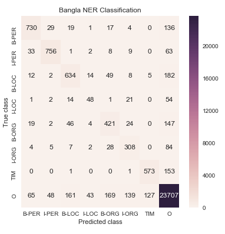

# Bengali-NER
Sequence labeling is a complex task in natural language processing where the data set used to be biased to a specific class mainly to “not named entity” class. Previously several machine learning approaches were harnessed for Bengali named entity recognition where additional information like Parts Of Speech (POS) tag, suffix value, optimal number of context words were required. This study aspires to give an overview of past methods on Bengali named entity task along with leveraging different neural networks on a new dataset at an easy way. A dataset consisting of 96697 tokens were annotated in the house where 67554 tokens were applied for training and 29143 words were for testing purposes. Then several deep learning methods were exploited where Bidirectional Gated Recurrent Unit (BGRU) came up victorious with f1 score 72.66%. The value may not be promising after comparing with other methods but different studies calculated the precision and recall value differently. Increasing the number of training data could raise the performance metrics along with other forms of word embedding.

If You are benifitted from this repo please cite this paper:
https://ieeexplore.ieee.org/document/8944804
